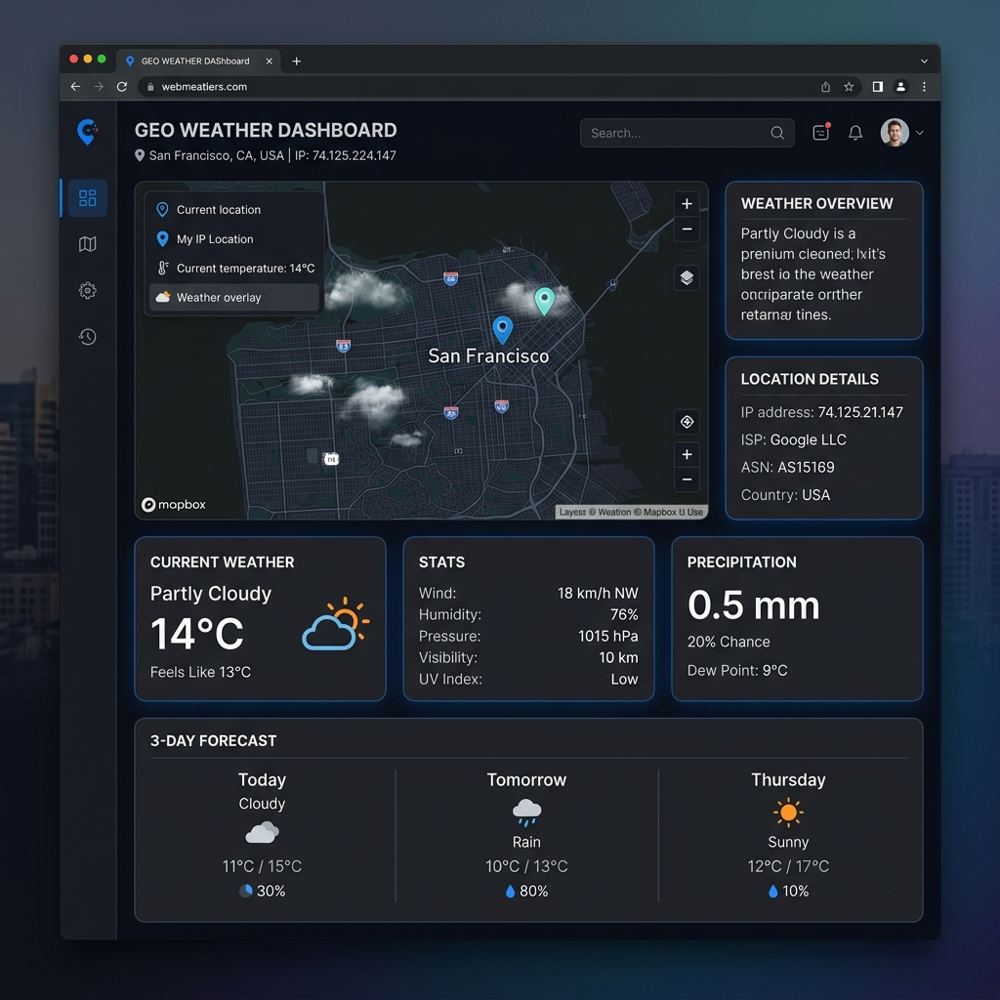

# Day 01: Geolocation & Live Weather Dashboard 🌍☀️

A premium, interactive single-page dashboard that automatically detects the user's location via their IP address, renders their location on a live interactive map, and displays their current weather and a 3-day meteorological forecast.

---

## 📸 Preview


---

## 🛠️ Combined APIs
This micro-app combines two free, keyless public APIs:

1. **IP-API** (`http://ip-api.com/json/`)
   * **Purpose**: Fetches client geographical context (city, region, country, country code), local timezone, internet service provider (ISP), and latitude/longitude coordinates.
   * **Fallback**: Uses `https://ipapi.co/json/` for SSL/HTTPS connection compatibility.

2. **Open-Meteo API** (`https://open-meteo.com`)
   * **Purpose**: Fetches real-time weather stats and 3-day forecasts based on coordinates returned by the geolocation API.
   * **Endpoint**: `https://api.open-meteo.com/v1/forecast?latitude={lat}&longitude={lon}&current_weather=true&daily=temperature_2m_max,temperature_2m_min,weathercode&timezone=auto`

---

## ✨ Features
* **Zero-Friction Geolocation**: Automatically tracks client IP location without requesting browser permission.
* **Interactive Map Mapping**: Dynamic dark-themed map centered on the client's coordinate zone using [Leaflet.js](https://leafletjs.com/) and CartoDB styles.
* **Extended Climate Forecast**: Renders current local temperature, apparent "feels-like" temperature, wind speed/direction, and a 3-day forecast layout.
* **Dynamic Emoji Flag Renderer**: Automatically parses the ISO country code to construct the correct country flag emoji.
* **Specs Modal**: Full transparency modal displaying API methods and parameters.

---

## 🚀 How to Run Locally
1. Navigate to the root directory of this repository.
2. Start a local server:
   ```bash
   python -m http.server 8000
   ```
3. Open your browser and go to: **`http://localhost:8000/day01/index.html`**
