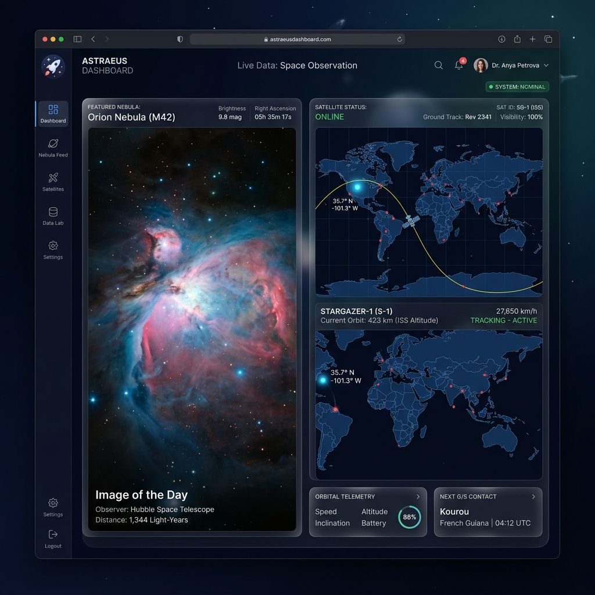

# Day 02: Astronomy APOD & ISS Tracker 🚀🛰️

A dashboard combining deep-space observational media with real-time low-earth-orbit telemetry tracking.

---

## 📸 Preview


---

## 🛠️ Combined APIs
This micro-app combines two free, keyless space telemetry APIs:

1. **NASA APOD (Astronomy Picture of the Day)** (`https://api.nasa.gov/planetary/apod?api_key=DEMO_KEY`)
   * **Purpose**: Fetches the daily space photograph or video selected by NASA astronomers, complete with descriptions and copyright metadata.
   * **Setup**: Uses the default rate-limited `DEMO_KEY` for instant, zero-configuration loading.

2. **Open Notify ISS Location API** (`http://api.open-notify.org/iss-now.json`)
   * **Purpose**: Fetches the live geographical coordinates (latitude/longitude) of the International Space Station orbiting at ~27,600 km/h.
   * **Polling**: Polled every 5 seconds to provide continuous real-time telemetry updates.

---

## ✨ Features
* **Dual Media Handlers**: Dynamically detects if the daily APOD is an image or a YouTube video iframe and updates the DOM accordingly.
* **Collapsible Space Explanations**: A custom sliding accordion panel revealing detail descriptions on-demand.
* **ISS Live Flight Trail**: Draws a continuous dotted purple orbital trail on the map, mapping the station's path over the last 50 data fetches.
* **Custom Satellite Icon**: Replaces Leaflet's default pin marker with a detailed ISS SVG layout.
* **Active Countdown Clock**: Displays a ticking countdown timer ("5s", "4s", ...) indicating when the next orbital coordinates will update.
* **API Specs Overlay**: Built-in specs card highlighting API endpoints.

---

## 🚀 How to Run Locally
1. Navigate to the root directory of this repository.
2. Start a local server:
   ```bash
   python -m http.server 8000
   ```
3. Open your browser and go to: **`http://localhost:8000/day02/index.html`**
